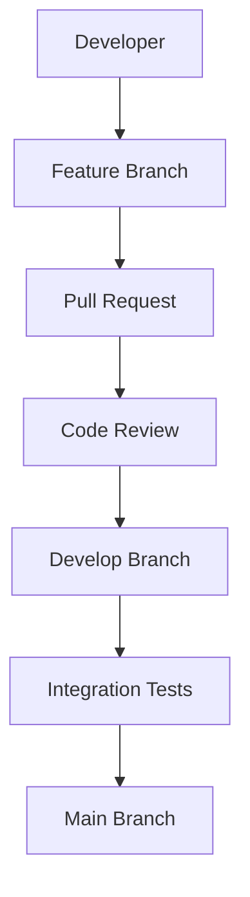
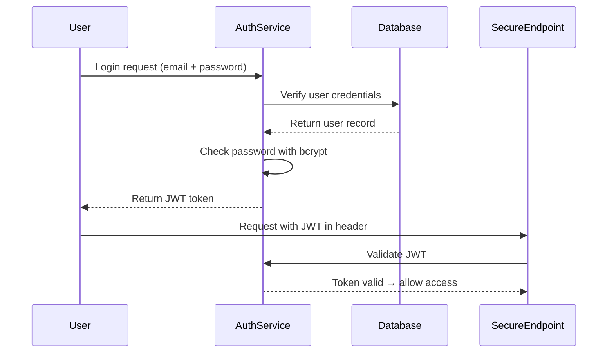

# ⚙️ Business Logic & Services Team Overview

The **Business Logic & Services Team** is responsible for implementing the core application logic of our Jakarta EE web application.  
This includes handling authentication, authorization, and service orchestration using **JWT**, **bcrypt**, and **CDI beans**.

---

## 🔧 Responsibilities
- Implement **business rules** and workflows for the application.
- Develop **CDI beans** to encapsulate reusable services.
- Handle **authentication** and **authorization** using JWT tokens.
- Secure user credentials with **bcrypt hashing**.
- Integrate with the **Database Dev Team** by consuming JPA entities and repositories.
- Ensure **role‑based access control** across the system.
- Write unit and integration tests for business logic components.
- Document service APIs and workflows for onboarding and maintenance.
- Collaborate with frontend and database teams to ensure consistent logic across layers.
- Monitor and improve application performance at the service layer.

---

## 🧪 Technologies Used

| Layer         | Technology              |
|---------------|-------------------------|
| Framework     | Jakarta EE              |
| Security      | JWT, bcrypt             |
| Dependency    | CDI (Contexts and Dependency Injection) |
| ORM           | JPA (Jakarta Persistence) |
| Testing       | JUnit, Arquillian       |
| Tools         | GitHub, Maven/Gradle    |

---

## 🔄 Workflow

1. **Create a feature branch**  
   Example: `feature/auth-service`

2. **Implement CDI bean**  
   ```java
   @ApplicationScoped
   public class AuthService {

       public String generateToken(User user) {
           // logic to create JWT
       }

       public boolean verifyPassword(String plain, String hashed) {
           return BCrypt.checkpw(plain, hashed);
       }
   }
   ```

3. **Push changes and open a Pull Request**
    - Target branch: `develop`
    - Include description of business logic changes

4. **Code review by team members**
    - Validate CDI usage, JWT handling, and bcrypt security

5. **Merge into `develop`**
    - After approval and integration testing

6. **Periodic merge into `main`**
    - For production‑ready business logic updates

---

## 👥 Collaboration Tips
- Use **GitHub Issues** to track business logic tasks and bugs.
- Discuss service design in **Pull Request comments**.
- Keep CDI beans **modular and reusable**.
- Document JWT claims and token expiration policies.
- Collaborate closely with the **Database Dev Team** to align entities and services.
- Use **GitHub Projects** to track feature development and milestones.
- Protect `main` branch with required PR reviews.

---

## 🗂️ Suggested Folder Structure

```
src/
└── main/
    └── java/
        └── com/
            └── example/
                └── service/
                    ├── AuthService.java
                    ├── UserService.java
                    └── JobService.java
resources/
└── META-INF/
    └── beans.xml
```

---

## 📊 Collaboration Diagram (Mermaid)



---

## 🔐 JWT Authentication Flow (Mermaid)



---

## ✅ Best Practices
- Protect `main` branch (require PR reviews before merging).
- Keep CDI beans small and focused on single responsibilities.
- Use **bcrypt** for password hashing, never store plain text.
- Ensure JWT tokens have proper expiration and claims.
- Write **unit tests** for each service method.
- Document workflows in the repo’s **Wiki** for onboarding.
- Collaborate with Database Dev Team to ensure consistency between entities and services.
- Apply **role-based access control** (RBAC) consistently across endpoints.
- Regularly review and update **security policies**.

---

This document ensures new contributors understand the **Business Logic & Services Team’s role, workflow, and collaboration practices** in the GitHub organization.
```


