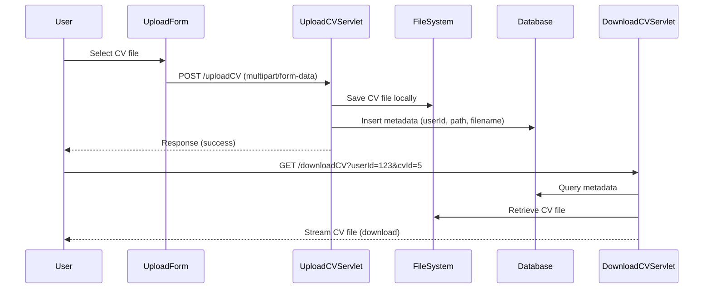

Here’s the extended **developer-friendly Markdown guide** showing how to integrate **database metadata storage (MySQL)** into your CV upload/download system. This allows you to track and manage CVs at scale.

---

# 📂 CV Upload & Download with Local File System + MySQL

This guide extends the CV upload/download workflow by adding **database integration**. The database stores metadata such as filename, path, user ID, and upload date.

---

## 🔄 Flow Overview

1. **UploadCVServlet**
    - Saves CV file to local file system.
    - Stores metadata in MySQL (filename, path, user ID, timestamp).

2. **DownloadCVServlet**
    - Retrieves metadata from MySQL.
    - Uses stored path to locate file.
    - Streams file securely to client.

3. **Database Schema**
    - Table `cv_files` tracks uploads.

---

## 🗄️ Database Schema (MySQL)

```sql
CREATE TABLE cv_files (
    id INT AUTO_INCREMENT PRIMARY KEY,
    user_id INT NOT NULL,
    file_name VARCHAR(255) NOT NULL,
    file_path VARCHAR(500) NOT NULL,
    upload_date TIMESTAMP DEFAULT CURRENT_TIMESTAMP
);
```

- **`user_id`**: Links CV to the user.
- **`file_name`**: Original filename.
- **`file_path`**: Absolute/relative path on server.
- **`upload_date`**: Timestamp of upload.

---

## 🚀 UploadCVServlet with DB Integration

## 📝 Upload Form (HTML)

```html
<!DOCTYPE html>
<html>
<head>
    <title>Upload CV</title>
</head>
<body>
    <form action="uploadCV" method="post" enctype="multipart/form-data">
        <label for="cv">Select CV (PDF/DOCX):</label>
        <input type="file" name="cv" accept=".pdf,.doc,.docx" required>
        <button type="submit">Upload</button>
    </form>
</body>
</html>
```
```java
import javax.servlet.annotation.MultipartConfig;
import javax.servlet.annotation.WebServlet;
import javax.servlet.http.*;
import java.io.*;
import java.sql.*;

@WebServlet("/uploadCV")
@MultipartConfig
public class UploadCVServlet extends HttpServlet {

    private static final String UPLOAD_DIR = "/var/app/uploads/cv"; // external directory

    @Override
    protected void doPost(HttpServletRequest request, HttpServletResponse response)
            throws IOException {

        int userId = Integer.parseInt(request.getParameter("userId")); // from session or form

        for (Part part : request.getParts()) {
            String fileName = extractFileName(part);

            if (fileName != null && !fileName.isEmpty()) {
                String uniqueFileName = userId + "_" + System.currentTimeMillis() + "_" + fileName;
                String filePath = UPLOAD_DIR + File.separator + uniqueFileName;

                // ✅ Save file locally
                part.write(filePath);

                // ✅ Save metadata in DB
                try (Connection conn = DriverManager.getConnection(
                        "jdbc:mysql://localhost:3306/yourdb", "user", "password")) {

                    String sql = "INSERT INTO cv_files (user_id, file_name, file_path) VALUES (?, ?, ?)";
                    PreparedStatement stmt = conn.prepareStatement(sql);
                    stmt.setInt(1, userId);
                    stmt.setString(2, uniqueFileName);
                    stmt.setString(3, filePath);
                    stmt.executeUpdate();

                } catch (SQLException e) {
                    response.sendError(HttpServletResponse.SC_INTERNAL_SERVER_ERROR, "DB error: " + e.getMessage());
                    return;
                }

                response.getWriter().println("CV uploaded successfully: " + uniqueFileName);
            }
        }
    }

    private String extractFileName(Part part) {
        String contentDisp = part.getHeader("content-disposition");
        for (String token : contentDisp.split(";")) {
            if (token.trim().startsWith("filename")) {
                return token.substring(token.indexOf("=") + 2, token.length() - 1);
            }
        }
        return null;
    }
}
```

---

## 🚀 DownloadCVServlet with DB Integration

```java
import javax.servlet.annotation.WebServlet;
import javax.servlet.http.*;
import java.io.*;
import java.sql.*;

@WebServlet("/downloadCV")
public class DownloadCVServlet extends HttpServlet {

    @Override
    protected void doGet(HttpServletRequest request, HttpServletResponse response)
            throws IOException {

        int userId = Integer.parseInt(request.getParameter("userId"));
        int cvId = Integer.parseInt(request.getParameter("cvId"));

        try (Connection conn = DriverManager.getConnection(
                "jdbc:mysql://localhost:3306/yourdb", "user", "password")) {

            String sql = "SELECT file_name, file_path FROM cv_files WHERE id=? AND user_id=?";
            PreparedStatement stmt = conn.prepareStatement(sql);
            stmt.setInt(1, cvId);
            stmt.setInt(2, userId);
            ResultSet rs = stmt.executeQuery();

            if (rs.next()) {
                String fileName = rs.getString("file_name");
                String filePath = rs.getString("file_path");

                File file = new File(filePath);
                if (!file.exists()) {
                    response.sendError(HttpServletResponse.SC_NOT_FOUND, "File not found");
                    return;
                }

                response.setContentType(getServletContext().getMimeType(filePath));
                response.setHeader("Content-Disposition", "attachment;filename=" + fileName);
                response.setContentLength((int) file.length());

                try (FileInputStream inStream = new FileInputStream(file);
                     OutputStream outStream = response.getOutputStream()) {

                    byte[] buffer = new byte[4096];
                    int bytesRead;
                    while ((bytesRead = inStream.read(buffer)) != -1) {
                        outStream.write(buffer, 0, bytesRead);
                    }
                }
            } else {
                response.sendError(HttpServletResponse.SC_FORBIDDEN, "No CV found for user");
            }

        } catch (SQLException e) {
            response.sendError(HttpServletResponse.SC_INTERNAL_SERVER_ERROR, "DB error: " + e.getMessage());
        }
    }
}
```

---

## ✅ Best Practices

- **External Storage**  
  Store files outside the webapp root (`/var/app/uploads/`) to avoid redeployment issues.

- **Unique Filenames**  
  Use `userId + timestamp` to prevent collisions.

- **Database Metadata**  
  Store file path, user ID, and upload date for easy retrieval.

- **Access Control**  
  Ensure only the CV owner or admins can download.

- **Prepared Statements**  
  Prevent SQL injection.

- **Connection Pooling**  
  Use a connection pool (e.g., HikariCP) instead of raw `DriverManager`.

- **Error Handling**  
  Return meaningful HTTP codes (`400`, `403`, `404`, `500`).

---

## 📊 Extended Flow Diagram



---