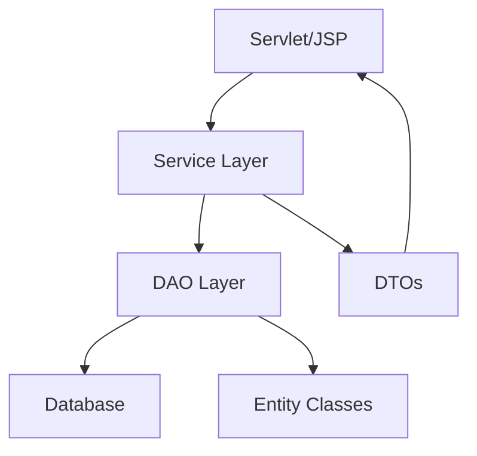

# 📦 Database Dev Team Overview

The **Database Dev Team** is responsible for designing, implementing, and maintaining the data layer of our Jakarta EE web application.  
We use **MySQL** as our relational database and **JPA (Java Persistence API)** for object‑relational mapping.  
Our persistence layer follows the **DAO (Data Access Object)** pattern, and we use **DTOs (Data Transfer Objects)** to safely move data between layers.

---

## 🔧 Responsibilities
- Define and evolve the **MySQL schema** to support application features.
- Create and maintain **JPA entity classes** that map Java objects to database tables.
- Implement **DAO classes** to encapsulate CRUD operations and queries.
- Use **DTOs** to transfer data between persistence and presentation layers.
- Manage **relationships** (e.g., `@OneToMany`, `@ManyToOne`, `@ManyToMany`) and **constraints**.
- Write and review **data migration scripts** and **initial seed data**.
- Ensure **data integrity**, **performance**, and **security** across environments.
- Collaborate with the Business Logic Team to align entities and services.
- Document schema changes and entity updates for onboarding and future maintenance.
- Monitor database performance and optimize queries.
- Handle backup, restore, and disaster recovery strategies.

---

## 🧪 Technologies Used

| Layer         | Technology              |
|---------------|-------------------------|
| Database      | MySQL                   |
| ORM           | JPA (Jakarta Persistence) |
| Framework     | Jakarta EE              |
| Persistence   | DAO Pattern             |
| Data Transfer | DTOs (Data Transfer Objects) |
| Tools         | Hibernate, Flyway (optional), GitHub |
| Testing       | JUnit, Testcontainers   |

---

## 🔄 Workflow

1. **Create a feature branch**  
   Example: `feature/student-dao`

2. **Define JPA entity**  
   ```java
   @Entity
   public class Student {
     @Id
     @GeneratedValue
     private Long id;

     private String name;
     private String email;
   }
   ```

3. **Implement DAO class**
   ```java
   public class StudentDAO {
       public Student findById(Long id) {
           // JPA query or JDBC logic
       }

       public void save(Student student) {
           // persist student
       }
   }
   ```

4. **Create DTO for safe transfer**
   ```java
   public class StudentDTO {
       private String name;
       private String email;

       // getters and setters
   }
   ```

5. **Push changes and open a Pull Request**
   - Target branch: `develop`
   - Include description of schema, DAO, and DTO changes

6. **Code review by team members**
   - Validate entity mappings, DAO queries, and DTO usage

7. **Merge into `develop`**
   - After approval and integration testing

8. **Periodic merge into `main`**
   - For production‑ready persistence updates

---

## 👥 Collaboration Tips
- Use **GitHub Issues** to track DAO/DTO tasks and bugs.
- Discuss entity and DAO design in **Pull Request comments**.
- Keep DAO classes **focused on persistence logic only**.
- Use DTOs to decouple persistence from presentation (Servlets/JSP).
- Document schema and DAO changes in the repo’s **Wiki**.
- Collaborate closely with the Business Logic Team to ensure DTOs match service needs.

---

## 🗂️ Suggested Folder Structure

```
src/
└── main/
    └── java/
        └── com/
            └── example/
                ├── entity/
                │   ├── Student.java
                │   ├── Company.java
                │   └── Job.java
                ├── dao/
                │   ├── StudentDAO.java
                │   ├── CompanyDAO.java
                │   └── JobDAO.java
                └── dto/
                    ├── StudentDTO.java
                    ├── CompanyDTO.java
                    └── JobDTO.java
resources/
└── db/
    ├── schema.sql
    ├── seed-data.sql
    └── migrations/
        ├── V1__init.sql
        ├── V2__add_job_table.sql
        └── V3__update_company_schema.sql
```

---

## 📊 Persistence Flow Diagram (Mermaid)



---

## ✅ Best Practices
- Protect `main` branch (require PR reviews before merging).
- Keep DAO classes small and focused on CRUD/query logic.
- Use DTOs to avoid exposing entities directly to the presentation layer.
- Apply **naming conventions** for tables, entities, DAOs, and DTOs.
- Automate migrations with **Flyway** or **Liquibase**.
- Write **unit tests** for DAO methods and DTO mappings.
- Regularly review **foreign key constraints** to ensure data integrity.
- Document DAO and DTO usage for onboarding new contributors.

---

This document ensures new contributors understand the **Database Dev Team’s role, DAO/DTO usage, workflow, and collaboration practices** in the GitHub organization.
```
