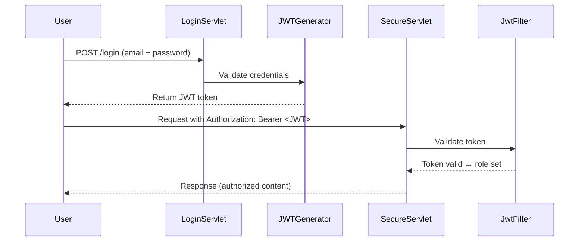
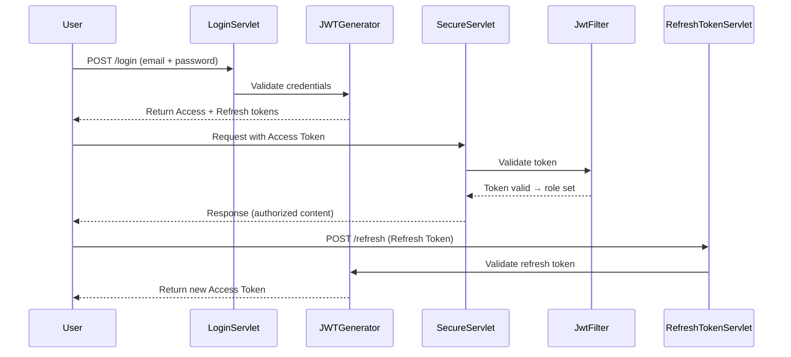

# 🔐 JWT Authorization with Servlets

This guide shows how to implement **JWT-based authentication and authorization** in a Java Servlet environment. It includes a **reusable `JwtFilter` class** that automatically protects secure endpoints.

---

## 📌 Why JWT with Servlets?

- **Stateless authentication**: No need for server-side sessions.
- **Portable**: Works across browsers, mobile apps, and APIs.
- **Secure**: Signed tokens prevent tampering.
- **Flexible**: Claims can carry roles, permissions, and metadata.

---

## 🛠️ JwtFilter Class

```java
import io.jsonwebtoken.Claims;
import io.jsonwebtoken.JwtException;
import io.jsonwebtoken.Jwts;

import javax.servlet.*;
import javax.servlet.http.HttpServletRequest;
import javax.servlet.http.HttpServletResponse;
import java.io.IOException;

public class JwtFilter implements Filter {

    private final String secretKey = "your-secret-key"; // 🔑 Store securely (env variable)

    @Override
    public void doFilter(ServletRequest request, ServletResponse response, FilterChain chain)
            throws IOException, ServletException {

        HttpServletRequest httpRequest = (HttpServletRequest) request;
        HttpServletResponse httpResponse = (HttpServletResponse) response;

        String authHeader = httpRequest.getHeader("Authorization");

        if (authHeader != null && authHeader.startsWith("Bearer ")) {
            String token = authHeader.substring(7); // Remove "Bearer "

            try {
                // ✅ Parse and validate JWT
                Claims claims = Jwts.parser()
                        .setSigningKey(secretKey)
                        .parseClaimsJws(token)
                        .getBody();

                // ✅ Extract role claim
                String role = claims.get("role", String.class);

                // ✅ Attach role to request for downstream servlets
                httpRequest.setAttribute("role", role);

                chain.doFilter(request, response); // Continue request flow

            } catch (JwtException e) {
                // ❌ Invalid or expired token
                httpResponse.sendError(HttpServletResponse.SC_UNAUTHORIZED, "Invalid or expired token");
            }

        } else {
            // ❌ Missing Authorization header
            httpResponse.sendError(HttpServletResponse.SC_UNAUTHORIZED, "Missing Authorization header");
        }
    }

    @Override
    public void init(FilterConfig filterConfig) {}
    @Override
    public void destroy() {}
}
```

---

## 🔎 Explanation of Key Concepts

- **`Authorization` Header**  
  Clients send `Authorization: Bearer <JWT>` with every request.

- **Token Validation**  
  The filter uses `Jwts.parser()` to verify the signature and expiration.

- **Claims Extraction**  
  Roles and user info are extracted from the token payload.

- **Request Attributes**  
  The role is attached to the request (`request.setAttribute("role", role)`), so servlets can enforce RBAC.

- **Error Handling**
    - `401 Unauthorized`: Missing or invalid token.
    - `403 Forbidden`: Token valid but insufficient role.

---

## ⚙️ Registering the Filter

In `web.xml`:

```xml
<filter>
    <filter-name>JwtFilter</filter-name>
    <filter-class>com.example.security.JwtFilter</filter-class>
</filter>

<filter-mapping>
    <filter-name>JwtFilter</filter-name>
    <url-pattern>/secure/*</url-pattern>
</filter-mapping>
```

This ensures **all endpoints under `/secure/*` are protected**.

---

## 🛡️ Using Role-Based Access in Servlets

```java
    String role = (String) request.getAttribute("role");
    
    if ("ADMIN".equals(role)) {
        response.getWriter().write("Welcome, Admin!");
    } else {
        response.sendError(HttpServletResponse.SC_FORBIDDEN, "Access denied");
    }
```

---

## ✅ Best Practices

- **Secret Key Management**
    - Never hardcode keys.
    - Use environment variables or a secrets manager.

- **Token Expiration**
    - Always set `exp` claim.
    - Example: `1h` lifetime.

- **HTTPS Only**
    - Prevent token interception.

- **Refresh Tokens**
    - Issue long-lived refresh tokens for session renewal.

- **Error Codes**
    - `401 Unauthorized`: Invalid/missing token.
    - `403 Forbidden`: Valid token, insufficient role.

- **Logging**
    - Log failed attempts for auditing.

---

## 📊 Flow Diagram



---


# 🔐 JWT Authorization with Servlets (Extended Guide)

This guide expands on the previous JWT + Servlet workflow by adding **refresh tokens** for long-lived sessions.

---

## 📌 Why Refresh Tokens?

- **Access tokens (JWTs)** should be short-lived (e.g., 15–60 minutes).
- **Refresh tokens** are long-lived (days/weeks) and used to request new access tokens.
- This prevents stolen access tokens from being valid indefinitely.
- Refresh tokens are usually stored securely (e.g., HTTP-only cookies).

---

## 🛠️ RefreshTokenServlet Example

```java
import io.jsonwebtoken.Jwts;
import io.jsonwebtoken.SignatureAlgorithm;

import javax.servlet.*;
import javax.servlet.http.*;
import java.io.IOException;
import java.util.Date;

public class RefreshTokenServlet extends HttpServlet {

    private final String secretKey = "your-secret-key"; // 🔑 Store securely
    private final long accessTokenValidity = 15 * 60 * 1000; // 15 minutes
    private final long refreshTokenValidity = 7 * 24 * 60 * 60 * 1000; // 7 days

    @Override
    protected void doPost(HttpServletRequest request, HttpServletResponse response)
            throws ServletException, IOException {

        String refreshToken = request.getHeader("Authorization");

        if (refreshToken != null && refreshToken.startsWith("Bearer ")) {
            refreshToken = refreshToken.substring(7);

            try {
                // ✅ Validate refresh token
                Jwts.parser().setSigningKey(secretKey).parseClaimsJws(refreshToken);

                // ✅ Issue new access token
                String newAccessToken = Jwts.builder()
                        .setSubject("user@example.com") // Replace with actual user ID
                        .claim("role", "USER")
                        .setExpiration(new Date(System.currentTimeMillis() + accessTokenValidity))
                        .signWith(SignatureAlgorithm.HS256, secretKey)
                        .compact();

                response.setHeader("Authorization", "Bearer " + newAccessToken);
                response.getWriter().write("New access token issued");

            } catch (Exception e) {
                response.sendError(HttpServletResponse.SC_UNAUTHORIZED, "Invalid refresh token");
            }
        } else {
            response.sendError(HttpServletResponse.SC_UNAUTHORIZED, "Missing refresh token");
        }
    }
}
```

---

## 🔎 Explanation of Key Concepts

- **Access Token**
    - Short-lived JWT used for API requests.
    - Expiration forces regular renewal.

- **Refresh Token**
    - Long-lived JWT used only to request new access tokens.
    - Should never be sent with normal API requests.

- **Refresh Flow**
    1. User logs in → receives **access token** + **refresh token**.
    2. Access token expires after 15–60 minutes.
    3. Client calls `/refresh` endpoint with refresh token.
    4. Server validates refresh token and issues a new access token.

---

## ⚙️ Registering the Servlet

In `web.xml`:

```xml
<servlet>
    <servlet-name>RefreshTokenServlet</servlet-name>
    <servlet-class>com.example.security.RefreshTokenServlet</servlet-class>
</servlet>

<servlet-mapping>
    <servlet-name>RefreshTokenServlet</servlet-name>
    <url-pattern>/refresh</url-pattern>
</servlet-mapping>
```

---

## ✅ Best Practices for Refresh Tokens

- **Store securely**
    - Use HTTP-only cookies to prevent JavaScript access.
    - Avoid local storage for refresh tokens.

- **Rotate tokens**
    - Issue a new refresh token each time one is used.
    - Invalidate old refresh tokens to prevent reuse.

- **Blacklist compromised tokens**
    - Maintain a server-side list of revoked refresh tokens.

- **Limit scope**
    - Refresh tokens should only be valid for issuing new access tokens, not accessing resources.

- **Expiration**
    - Set refresh tokens to expire after days/weeks.
    - Force re-login after expiration.

---

## 📊 Extended Flow Diagram



---

