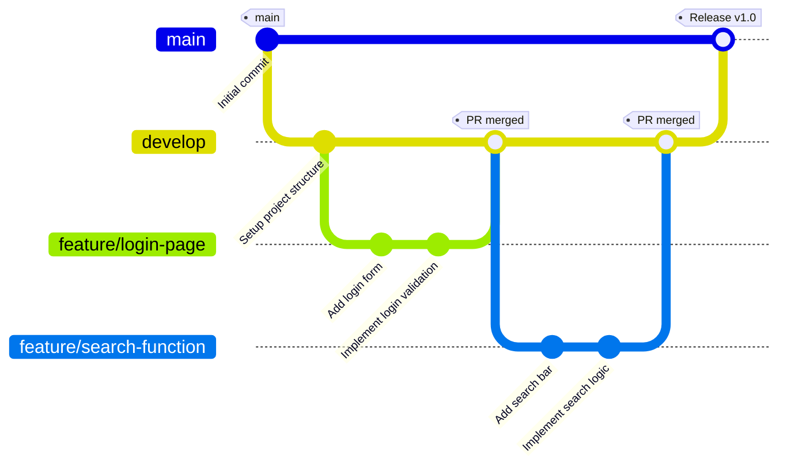

# Contributing Guide

Thank you for contributing to **Job-Finder**!  
We follow a **Git Flow style workflow** with three key branch types:

- **`main`** → Always production-ready code.
- **`develop`** → Integration branch where features are merged before release.
- **feature branches** → Short-lived branches for specific tasks or bug fixes.

## In Git workflows, **`main`** and **`develop`** serve very different purposes, and together they help balance stability with ongoing development:

---

## 🌟 Main Branch
- **Purpose**: Always contains **production-ready code**.
- **Characteristics**:
    - Code here has passed reviews, testing, and QA.
    - Represents the version currently deployed or ready to deploy.
    - Protected: contributors don’t commit directly; changes arrive via Pull Requests.
- **Analogy**: Think of `main` as the “release shelf” — only polished, stable features are placed here.

---

## 🔧 Develop Branch
- **Purpose**: Acts as the **integration branch** where features are merged before release.
- **Characteristics**:
    - Developers branch off `develop` to create feature branches.
    - Serves as a shared testing environment.
    - Once stable, `develop` is merged into `main` for release.
- **Analogy**: `develop` is the “workbench” — features are assembled and tested here before being shipped.

---

## 📊 Comparison Table

| Branch   | Role                        | Who Works Here | Stability Level |
|----------|-----------------------------|----------------|-----------------|
| `main`   | Production-ready code       | Release managers, CI/CD | Very stable |
| `develop`| Integration/testing branch  | All developers | Moderately stable |

---

## 🚀 Typical Workflow
1. Developer creates a **feature branch** from `develop`.
2. Work is done and merged back into `develop`.
3. Once `develop` is stable and tested, it’s merged into `main`.
4. `main` is then deployed to production.

---

This separation ensures that `main` stays clean and reliable, while `develop` gives the team freedom to integrate and test new work without breaking production.

---

👉 Would you like me to also illustrate this with a **Mermaid diagram** showing how `main`, `develop`, and feature branches interact visually?


This guide explains how to contribute step by step.

---

## 🔄 Workflow Overview

1. Clone the repository.
2. Switch to the `develop` branch.
3. Create a feature branch for your work.
4. Commit and push changes.
5. Open a Pull Request (PR) into `develop`.
6. Delete the feature branch after merging.

---

## 🛠️ Step 1: Clone the Repository

```bash
git clone https://github.com/youth-job-finder/Job-Finder.git
cd Job-Finder
```

**Explanation:**  
This downloads the repository to your local machine and moves you into the project folder.

---

## 🛠️ Step 2: Switch to `develop`

```bash
git fetch origin
git checkout develop
git pull origin develop
```

**Explanation:**
- `git fetch origin` updates your local copy of remote branches.
- `git checkout develop` switches to the `develop` branch.
- `git pull origin develop` ensures you have the latest changes.

---

## 🛠️ Step 3: Create a Feature Branch

```bash
git checkout -b feature/<short-description>
```

**Example:**
```bash
git checkout -b feature/login-page
```

**Explanation:**  
This creates a new branch from `develop` for your specific task.  
Use descriptive names like `feature/login-page` or `bugfix/search-error`.

---

## 🛠️ Step 4: Commit and Push Changes

```bash
git add .
git commit -m "Implement login page"
git push -u origin feature/login-page
```

**Explanation:**
- `git add .` stages all changes.
- `git commit -m` saves your changes with a message.
- `git push -u origin` uploads your branch to GitHub.

---

## 🛠️ Step 5: Open a Pull Request (PR) into `develop`

1. Go to the repository on GitHub.
2. GitHub will suggest opening a PR for your branch. Click **Compare & pull request**.
3. Ensure:
    - **Base branch** = `develop`
    - **Compare branch** = `feature/<your-branch>`
4. Add a descriptive title and summary.
5. Click **Create pull request**.
6. Wait for review and approval.
7. Once approved, click **Merge pull request**.

**Explanation:**  
This ensures all new work flows into `develop` before reaching `main`.

---

## 🛠️ Step 6: Delete the Feature Branch After Merging

- **On GitHub:**  
  After merging, click **Delete branch** in the PR page.

- **Locally:**
  ```bash
  git checkout develop
  git branch -d feature/<your-branch>
  ```
  If Git complains the branch isn’t fully merged, use:
  ```bash
  git branch -D feature/<your-branch>
  ```

**Explanation:**  
Deleting feature branches keeps the repository clean and avoids clutter.

---

## ✅ Best Practices

- Always branch off `develop`, not `main`.
- Write clear commit messages (imperative style: *Add login page*).
- Keep PRs small and focused.
- Run tests before pushing.
- Protect `main` and `develop` with branch protection rules (reviews + CI checks).

---

## 📊 Visual Workflow Diagram



**Explanation:**
- `main` holds production-ready releases.
- `develop` integrates features.
- Feature branches are created, worked on, and merged back into `develop`.
- When `develop` is stable, it’s merged into `main` for release.

---

## 📖 Summary

- **Clone → Checkout `develop` → Create feature branch → Commit → Push → PR into `develop` → Delete branch.**
- `main` stays production-ready.
- `develop` is the integration branch.
- Feature branches are short-lived and task-specific.

---
