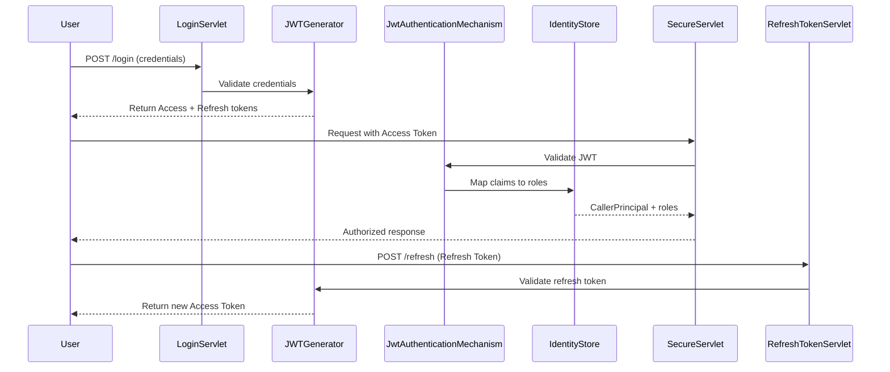

# 🔐 Security Guide: JWT + Jakarta Security + Refresh Tokens

This guide explains how to combine **JWT authentication**, **Jakarta Security authorization**, and **refresh tokens** in a Jakarta EE application.

---

## 🔄 Flow Overview

1. **Login Servlet**
    - Validates credentials.
    - Issues **access token (JWT)** + **refresh token**.

2. **JwtAuthenticationMechanism**
    - Extracts JWT from `Authorization` header.
    - Validates token signature and expiration.
    - Maps claims to Jakarta Security roles.

3. **IdentityStore**
    - Provides role mapping from JWT claims.
    - Supplies `CallerPrincipal` (user identity).

4. **Authorization**
    - Use Jakarta Security annotations (`@RolesAllowed`, `@PermitAll`, `@DenyAll`).
    - Container enforces access automatically.

5. **RefreshTokenServlet**
    - Validates refresh token.
    - Issues new access token.
    - Optionally rotates refresh tokens.

---

## 🛠️ Login Servlet (Issue Access + Refresh Tokens)

```java
@WebServlet("/login")
public class LoginServlet extends HttpServlet {

    private final String secretKey = "your-secret-key";
    private final long accessTokenValidity = 15 * 60 * 1000; // 15 minutes
    private final long refreshTokenValidity = 7 * 24 * 60 * 60 * 1000; // 7 days

    @Override
    protected void doPost(HttpServletRequest request, HttpServletResponse response)
            throws IOException {

        String email = request.getParameter("email");
        String password = request.getParameter("password");

        // ✅ Validate credentials (DAO + bcrypt)
        boolean valid = true; // Replace with actual validation
        if (!valid) {
            response.sendError(HttpServletResponse.SC_UNAUTHORIZED, "Invalid credentials");
            return;
        }

        // ✅ Issue Access Token
        String accessToken = Jwts.builder()
                .setSubject(email)
                .claim("role", "USER")
                .setExpiration(new Date(System.currentTimeMillis() + accessTokenValidity))
                .signWith(SignatureAlgorithm.HS256, secretKey)
                .compact();

        // ✅ Issue Refresh Token
        String refreshToken = Jwts.builder()
                .setSubject(email)
                .claim("type", "refresh")
                .setExpiration(new Date(System.currentTimeMillis() + refreshTokenValidity))
                .signWith(SignatureAlgorithm.HS256, secretKey)
                .compact();

        response.setHeader("Authorization", "Bearer " + accessToken);
        response.setHeader("X-Refresh-Token", refreshToken);
        response.getWriter().write("Login successful");
    }
}
```

---

## 🛠️ JwtAuthenticationMechanism (Access Token Validation)

```java
public class JwtAuthenticationMechanism implements HttpAuthenticationMechanism {

    private final String secretKey = "your-secret-key";

    @Override
    public AuthenticationStatus validateRequest(
            HttpServletRequest request,
            HttpServletResponse response,
            HttpMessageContext context) {

        String authHeader = request.getHeader("Authorization");
        if (authHeader != null && authHeader.startsWith("Bearer ")) {
            String token = authHeader.substring(7);

            try {
                Claims claims = Jwts.parser()
                        .setSigningKey(secretKey)
                        .parseClaimsJws(token)
                        .getBody();

                String userId = claims.getSubject();
                String role = claims.get("role", String.class);

                CredentialValidationResult result =
                        new CredentialValidationResult(userId, Set.of(role));

                return context.notifyContainerAboutLogin(result);

            } catch (Exception e) {
                return context.responseUnauthorized();
            }
        }
        return context.responseUnauthorized();
    }
}
```

---

## 🛡️ Authorization with Jakarta Security

```java
@WebServlet("/admin/dashboard")
@RolesAllowed("ADMIN")
public class AdminDashboardServlet extends HttpServlet {
    // Only accessible to ADMIN role
}
```

The container enforces access automatically based on JWT claims mapped to roles.

---

## 🛠️ RefreshTokenServlet (Renew Access Tokens)

```java
@WebServlet("/refresh")
public class RefreshTokenServlet extends HttpServlet {

    private final String secretKey = "your-secret-key";
    private final long accessTokenValidity = 15 * 60 * 1000; // 15 minutes

    @Override
    protected void doPost(HttpServletRequest request, HttpServletResponse response)
            throws IOException {

        String refreshToken = request.getHeader("X-Refresh-Token");

        if (refreshToken == null) {
            response.sendError(HttpServletResponse.SC_UNAUTHORIZED, "Missing refresh token");
            return;
        }

        try {
            Claims claims = Jwts.parser()
                    .setSigningKey(secretKey)
                    .parseClaimsJws(refreshToken)
                    .getBody();

            if (!"refresh".equals(claims.get("type", String.class))) {
                response.sendError(HttpServletResponse.SC_UNAUTHORIZED, "Invalid refresh token");
                return;
            }

            String userId = claims.getSubject();
            String role = "USER"; // Retrieve from DB if needed

            // ✅ Issue new Access Token
            String newAccessToken = Jwts.builder()
                    .setSubject(userId)
                    .claim("role", role)
                    .setExpiration(new Date(System.currentTimeMillis() + accessTokenValidity))
                    .signWith(SignatureAlgorithm.HS256, secretKey)
                    .compact();

            response.setHeader("Authorization", "Bearer " + newAccessToken);
            response.getWriter().write("New access token issued");

        } catch (Exception e) {
            response.sendError(HttpServletResponse.SC_UNAUTHORIZED, "Invalid refresh token");
        }
    }
}
```

---

## ✅ Best Practices

- **Access Tokens**
    - Short-lived (15–60 minutes).
    - Used for API requests.

- **Refresh Tokens**
    - Long-lived (days/weeks).
    - Used only for renewing access tokens.
    - Store securely (HTTP-only cookies).

- **Token Rotation**
    - Issue a new refresh token each time one is used.
    - Invalidate old refresh tokens.

- **RBAC with Jakarta Security**
    - Use `@RolesAllowed` for declarative authorization.
    - Avoid manual role checks in servlets.

- **Secure Key Management**
    - Store secret keys in environment variables.

- **HTTPS Only**
    - Prevent token interception.

---

## 📊 Flow Diagram



---

