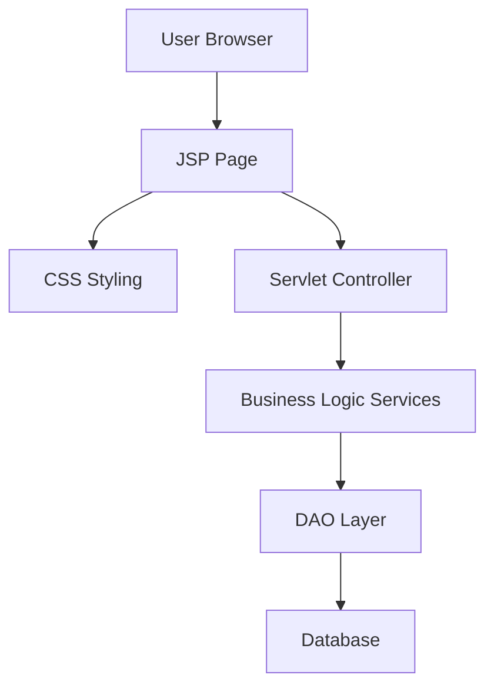

# 🎨 UI & Presentation Team Overview

The **UI & Presentation Team** is responsible for designing and implementing the user interface of our Jakarta EE web application.  
We use **JSP (JavaServer Pages)** for dynamic content rendering and **CSS** for styling and layout.  
This team ensures that the application is intuitive, responsive, and visually consistent across all modules.

---

## 🔧 Responsibilities
- Develop **JSP pages** to render dynamic content from the backend.
- Apply **CSS styling** to ensure consistent design and responsive layouts.
- Collaborate with the **Business Logic Team** to integrate services into JSP views.
- Work with the **Database Dev Team** to display entity data in user-friendly formats.
- Ensure accessibility and usability standards are met.
- Optimize UI performance (minimizing CSS/JS load times).
- Document UI components and styling guidelines for onboarding and consistency.

---

## 🧪 Technologies Used

| Layer         | Technology              |
|---------------|-------------------------|
| View          | JSP (JavaServer Pages)  |
| Styling       | CSS                     |
| Framework     | Jakarta EE              |
| Tools         | GitHub, Maven/Gradle    |
| Testing       | Selenium, JUnit (UI tests) |

---

## 🔄 Workflow

1. **Create a feature branch**  
   Example: `feature/login-page`

2. **Develop JSP page**  
   ```html
   <%@ page contentType="text/html;charset=UTF-8" language="java" %>
   <html>
   <head>
       <title>Login</title>
       <link rel="stylesheet" href="styles.css">
   </head>
   <body>
       <form action="login" method="post">
           <label>Email:</label>
           <input type="text" name="email"/>
           <label>Password:</label>
           <input type="password" name="password"/>
           <button type="submit">Login</button>
       </form>
   </body>
   </html>
   ```

3. **Style with CSS**
   ```css
   body {
       font-family: Arial, sans-serif;
       background-color: #f4f4f4;
   }

   form {
       margin: 50px auto;
       width: 300px;
       padding: 20px;
       background: #fff;
       border-radius: 5px;
   }

   input, button {
       display: block;
       width: 100%;
       margin-bottom: 10px;
   }
   ```

4. **Push changes and open a Pull Request**
    - Target branch: `develop`
    - Include screenshots or notes about UI changes

5. **Code review by team members**
    - Validate JSP logic, CSS consistency, and responsiveness

6. **Merge into `develop`**
    - After approval and UI testing

7. **Periodic merge into `main`**
    - For production‑ready UI updates

---

## 👥 Collaboration Tips
- Use **GitHub Issues** to track UI tasks and bugs.
- Discuss design changes in **Pull Request comments**.
- Keep JSP pages **modular** (use includes and tag libraries).
- Maintain a **shared CSS style guide** for consistency.
- Collaborate closely with Business Logic and Database teams to ensure seamless integration.
- Use **GitHub Projects** to track UI milestones.

---

## 🗂️ Suggested Folder Structure

```
src/
└── main/
    └── webapp/
        ├── WEB-INF/
        │   └── views/
        │       ├── login.jsp
        │       ├── dashboard.jsp
        │       └── jobs.jsp
        ├── css/
        │   └── styles.css
        └── js/
            └── scripts.js
```

---

## 📊 Collaboration Diagram (Mermaid)



---

## ✅ Best Practices
- Protect `main` branch (require PR reviews before merging).
- Keep JSP pages modular and avoid embedding complex logic.
- Use CSS classes consistently and maintain a style guide.
- Ensure UI is responsive and accessible.
- Test JSP pages with **Selenium** for functional validation.
- Document UI components for onboarding new contributors.
- Collaborate with backend teams to ensure data flows correctly into JSP views.

---

This document ensures new contributors understand the **UI & Presentation Team’s role, workflow, and collaboration practices** in the GitHub organization.
```

