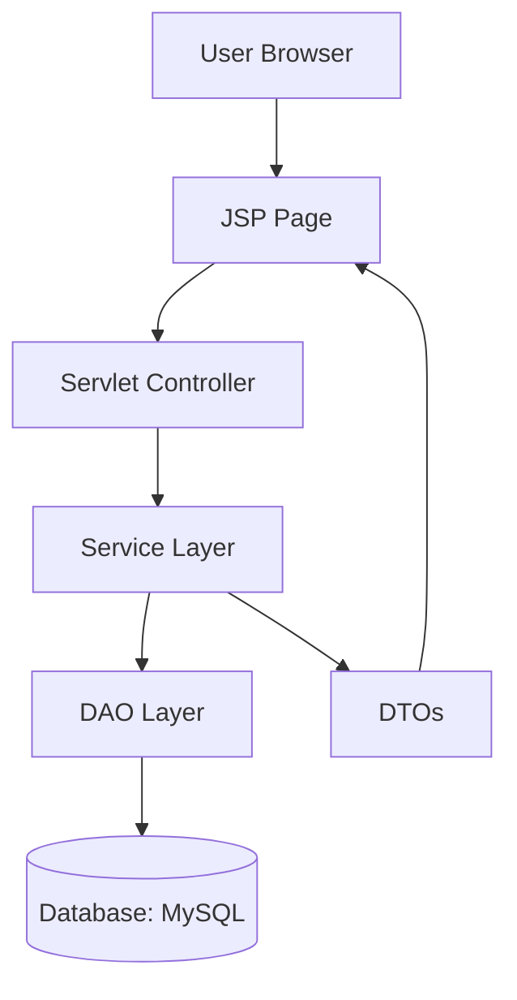

# 📖 Team Handbook: Youth Job & Internship Finder Web Application

This handbook outlines the responsibilities, workflows, and best practices for all development teams working on the **Youth Job & Internship Finder Web Application**.  
It covers the **Database Dev Team**, **Business Logic & Services Team**, **UI & Presentation Team**, and **DAO & DTO Team**.

---

# 📦 Database Dev Team Overview

The **Database Dev Team** is responsible for designing, implementing, and maintaining the data layer of our Jakarta EE web application.  
We use **MySQL** as our relational database and **JPA (Java Persistence API)** for object‑relational mapping.

## 🔧 Responsibilities
- Define and evolve the **MySQL schema**.
- Create and maintain **JPA entity classes**.
- Manage relationships and constraints.
- Write migration scripts and seed data.
- Ensure data integrity, performance, and security.
- Collaborate with backend developers to align entity models.
- Document schema changes for onboarding.
- Monitor and optimize queries.
- Handle backup and recovery strategies.

## 🧪 Technologies Used
| Layer         | Technology              |
|---------------|-------------------------|
| Database      | MySQL                   |
| ORM           | JPA (Jakarta Persistence) |
| Framework     | Jakarta EE              |
| Tools         | Hibernate, Flyway, GitHub |
| Testing       | JUnit, Testcontainers   |

## 🗂️ Folder Structure (this project)

```
src/main/java/com/jakartaee/jobfinder/
├── entity/           # JPA entities (User, Company, Job, Application, Review, …)
├── entity/role/
├── entity/status/
├── dao/              # UserDAO, CompanyDAO, JobDAO, …
└── dto/              # UserDTO, CompanyDTO, JobDTO, …

src/main/resources/db/
├── migrations/       # versioned SQL (e.g. V1__init.sql)
├── schema.sql        # optional full schema snapshot
└── seed-data.sql     # optional seed data
```

---

# ⚙️ Business Logic & Services Team Overview

The **Business Logic & Services Team** implements the core application logic.  
This includes authentication, authorization, and service orchestration using **JWT**, **bcrypt**, and **CDI beans**.

## 🔧 Responsibilities
- Implement business rules and workflows.
- Develop CDI beans for reusable services.
- Handle authentication and authorization.
- Secure credentials with bcrypt.
- Integrate with Database Dev Team.
- Ensure role‑based access control.
- Write unit and integration tests.
- Document service APIs and workflows.

## 🧪 Technologies Used
| Layer         | Technology              |
|---------------|-------------------------|
| Framework     | Jakarta EE              |
| Security      | JWT, bcrypt             |
| Dependency    | CDI                     |
| ORM           | JPA                     |
| Testing       | JUnit, Arquillian       |

## 🗂️ Business logic folder (target layout)

CDI service beans are the intended home for JWT, bcrypt, and orchestration. This project currently routes much of that through **servlets**; add under:

```
src/main/java/com/jakartaee/jobfinder/service/
├── AuthService.java    # (planned)
├── UserService.java
└── JobService.java

src/main/resources/META-INF/beans.xml
```

---

# 🎨 UI & Presentation Team Overview

The **UI & Presentation Team** designs and implements the user interface using **JSP** and **CSS**.  
They ensure the application is intuitive, responsive, and visually consistent.

## 🔧 Responsibilities
- Develop JSP pages for dynamic content.
- Apply CSS styling for layout and design.
- Collaborate with Business Logic Team to integrate services.
- Work with Database Team to display entity data.
- Ensure accessibility and usability.
- Optimize UI performance.
- Document UI components and styling guidelines.

## 🧪 Technologies Used
| Layer         | Technology              |
|---------------|-------------------------|
| View          | JSP                     |
| Styling       | CSS                     |
| Framework     | Jakarta EE              |
| Tools         | GitHub, Maven/Gradle    |
| Testing       | Selenium, JUnit         |

## 🗂️ UI folder (this project)

```
src/main/webapp/
├── WEB-INF/views/          # JSP pages (forwarded from servlets)
├── WEB-INF/views/components/
├── css/
└── js/
```

---

# 🗄️ DAO & DTO Team Overview

The **DAO & DTO Team** implements persistence patterns that connect the database with the rest of the application.  
We use **DAO** classes for database operations and **DTOs** to transfer data safely between layers.  
Collections from **`java.util`** (List, Set, Map, Queue) manage groups of entities and DTOs in memory.

## 🔧 Responsibilities
- Implement DAO classes for CRUD operations.
- Create DTO classes for safe data transfer.
- Use collections to manage entities and DTOs.
- Keep DAOs focused on persistence logic.
- Keep DTOs lightweight and free of business logic.
- Collaborate with Database and Business Logic teams.
- Document DAO and DTO usage for onboarding.

## 🧪 Technologies Used
| Layer         | Technology              |
|---------------|-------------------------|
| Persistence   | DAO Pattern             |
| Data Transfer | DTOs                    |
| Collections   | java.util (List, Set, Map, Queue) |
| ORM           | JPA                     |
| Database      | MySQL                   |

## 🗂️ DAO & DTO packages (this project)

```
com.jakartaee.jobfinder.entity.*
com.jakartaee.jobfinder.dao.*
com.jakartaee.jobfinder.dto.*
com.jakartaee.jobfinder.service.*   # when service beans are added
```

---

# 📊 Unified Flow Diagram (Mermaid)



---

# ✅ Best Practices
- Protect `main` branch (require PR reviews).
- Keep DAOs small and focused.
- Use DTOs to decouple persistence from presentation.
- Apply naming conventions consistently.
- Use collections appropriately (`List` for ordered results, `Set` for uniqueness, `Map` for lookups).
- Write unit tests for DAO, DTO, and service methods.
- Document workflows and patterns in the repo’s Wiki.
- Collaborate across teams to ensure smooth integration.

---

This **Team Handbook** ensures new contributors understand the roles, workflows, folder structures, and collaboration practices across all teams in the GitHub organization.

