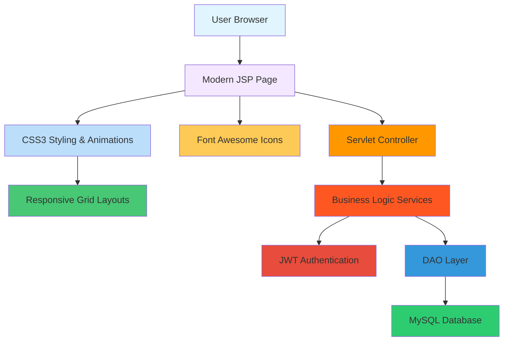

# 🎨 UI & Presentation Team Overview

The **UI & Presentation Team** is responsible for designing and implementing the **modern, responsive user interface** of our Jakarta EE web application.  
We use **JSP (JavaServer Pages)** for dynamic content rendering and **Modern CSS3** for styling and layout.  
This team ensures that the application is intuitive, responsive, and visually consistent across all modules with **sleek, contemporary design**.

---

## 🔧 Responsibilities

### Core UI Development
- Develop **modern JSP pages** to render dynamic content from backend.
- Apply **responsive CSS3 styling** with gradients, animations, and micro-interactions.
- Implement **mobile-first design** with hamburger menus and sidebar navigation.
- Create **component-based architecture** with reusable UI elements.
- Integrate **Font Awesome icons** for consistent visual language.

### Design System Implementation
- Build **modern color scheme** with professional gradients and brand consistency.
- Implement **card-based layouts** for jobs, companies, and content display.
- Create **smooth animations** and hover effects throughout the application.
- Ensure **typography hierarchy** with clean, readable fonts.

### User Experience Enhancement
- Design **advanced search interfaces** with real-time filtering capabilities.
- Implement **interactive hero sections** with floating elements and statistics.
- Create **responsive grid layouts** that adapt to all screen sizes.
- Ensure **WCAG 2.1 accessibility** compliance with semantic HTML5 and ARIA.

### Cross-Team Collaboration
- Collaborate with **Business Logic Team** to integrate services into modern JSP views.
- Work with **Database Dev Team** to display entity data in user-friendly formats.
- Coordinate with **Security Team** for authentication flows and protected content.
- Ensure UI performance optimization (minimizing CSS/JS load times).

---

## 🧪 Technologies Used

| Layer         | Technology |
|---------------|------------|
| View          | Modern JSP (JavaServer Pages) |
| Styling       | CSS3 + CSS Grid + Flexbox |
| Framework     | Jakarta EE 10 |
| Icons         | Font Awesome 6.4.0 |
| Tools         | GitHub, Maven |
| Testing       | Selenium, JUnit (UI tests) |
| Animations    | CSS3 Transitions & Keyframes |

---

## 🔄 Modern Development Workflow

### 1. **Create a feature branch**  
   Example: `feature/modern-hero-section`

### 2. **Develop Modern JSP page**  
   ```html
   <%@ page contentType="text/html;charset=UTF-8" language="java" %>
   <%@ taglib uri="http://java.sun.com/jsp/jstl/core" prefix="c" %>
   <!DOCTYPE html>
   <html lang="en">
   <head>
       <meta charset="UTF-8">
       <meta name="viewport" content="width=device-width, initial-scale=1.0">
       <title>JobFinder - Modern Job Platform</title>
       <link rel="stylesheet" href="<c:url value='/css/index.css'/>">
       <link rel="stylesheet" href="https://cdnjs.cloudflare.com/ajax/libs/font-awesome/6.4.0/css/all.min.css">
   </head>
   <body>
       <!-- Modern Hero Section -->
       <section class="hero">
           <div class="hero-background">
               <div class="hero-particles"></div>
           </div>
           <div class="hero-content">
               <h1 class="hero-title">
                   <span class="gradient-text">Discover Your Dream Career</span>
               </h1>
               <!-- Floating cards and animations -->
           </div>
       </section>
   </body>
   </html>
   ```

### 3. **Style with Modern CSS**
   ```css
   /* Modern Hero Section */
   .hero {
       position: relative;
       min-height: 100vh;
       background: linear-gradient(135deg, #667eea 0%, #764ba2 100%);
       display: flex;
       align-items: center;
       justify-content: center;
   }

   .gradient-text {
       background: linear-gradient(45deg, #fff, #f0f0f0);
       -webkit-background-clip: text;
       -webkit-text-fill-color: transparent;
       background-clip: text;
   }

   /* Floating Animations */
   @keyframes float {
       0%, 100% { transform: translateY(0px); }
       50% { transform: translateY(-20px); }
   }
   ```

### 4. **Push changes and open a Pull Request**
   - Target branch: `develop`
   - Include screenshots or notes about UI changes
   - Test responsive behavior on multiple devices

### 5. **Code review by team members**
   - Validate modern JSP logic, CSS consistency, and responsiveness
   - Check accessibility compliance (WCAG 2.1)
   - Review animation performance and loading states

### 6. **Merge into `develop`**
   - After approval and UI testing across browsers

### 7. **Periodic merge into `main`**
   - For production‑ready UI updates

---

## 👥 Collaboration Tips

### Modern Development Practices
- Use **GitHub Issues** to track UI tasks, bugs, and enhancement requests.
- Discuss design changes in **Pull Request comments** with screenshots.
- Keep JSP pages **modular** using includes and tag libraries.
- Maintain a **modern CSS style guide** for consistency.

### Component-Based Development
- Create **reusable UI components** (cards, buttons, forms, modals).
- Use **CSS custom properties** for consistent theming.
- Implement **design tokens** for colors, spacing, and typography.

### Performance & Accessibility
- **Optimize images** and use modern image formats (WebP, AVIF).
- Implement **lazy loading** for better performance.
- Ensure **keyboard navigation** and screen reader compatibility.
- Test with **mobile devices** and various screen sizes.

### Cross-Team Integration
- Collaborate closely with Business Logic and Database teams.
- Participate in **API design** discussions for frontend integration.
- Provide **UI specifications** for backend endpoints.

---

## 🗂️ Modern Folder Structure (this project)

JSP pages use both **webapp root** (for direct access) and **WEB-INF/views** (for protected content). Shared components live under **`WEB-INF/views/components`**. Modern CSS organized in dedicated folders.

```
src/main/webapp/
├── WEB-INF/
│   └── views/
│       ├── components/           # Shared UI fragments
│       │   ├── default-navbar.jsp  # Modern responsive navbar
│       │   ├── footer.jsp          # Consistent footer
│       │   └── ...               # Other shared components
│       └── secure/              # Protected pages
├── css/                       # Modern responsive stylesheets
│   ├── index.css              # Main modern design system
│   └── responsive.css         # Mobile-first responsive design
├── images/                    # Optimized images and assets
└── js/                        # Modern JavaScript (optional)
```

**Modern Pages:**
- `index.jsp` - Enhanced hero section with animations
- `jobs.jsp` - Card-based job listings with search
- `companies.jsp` - Company cards with verification badges
- `login.jsp` - Modern authentication forms
- `signup-options.jsp` - User registration flows

---

## 📊 Enhanced Collaboration Diagram (Mermaid)



---

## ✅ Modern Best Practices

### Design & Development
- **Mobile-first responsive design** with CSS Grid and Flexbox.
- **Component-based architecture** for maintainability.
- **Modern CSS features**: gradients, animations, custom properties.
- **Semantic HTML5** with proper accessibility attributes.

### Performance Optimization
- **Minimize HTTP requests** through CSS/JS bundling.
- **Optimize images** with modern formats and lazy loading.
- **Use efficient animations** with CSS transforms.
- **Implement caching strategies** for static assets.

### Accessibility & Usability
- **WCAG 2.1 AA compliance** with proper color contrast.
- **Keyboard navigation** support for all interactive elements.
- **Screen reader compatibility** with ARIA labels and roles.
- **Focus management** with visible indicators.

### Security Integration
- **CSRF protection** for all forms.
- **XSS prevention** with proper output encoding.
- **Secure authentication flows** with JWT tokens.
- **Input validation** with modern HTML5 features.

### Testing & Quality Assurance
- **Cross-browser testing** on modern browsers.
- **Responsive testing** on multiple devices and screen sizes.
- **Accessibility testing** with screen readers and keyboard.
- **Performance testing** with Lighthouse and WebPageTest.

---

## 🚀 Modern UI Features Implemented

### Hero Section Enhancements
- **Gradient backgrounds** with animated particle effects
- **Floating cards** with smooth animations
- **Statistics display** with animated counters
- **Call-to-action buttons** with hover effects

### Navigation & Layout
- **Sticky responsive navbar** with hamburger menu
- **Sidebar navigation** for mobile devices
- **Centered logo** with proper spacing
- **Role-based navigation** with conditional rendering

### Content Presentation
- **Card-based layouts** for jobs and companies
- **Advanced search** with real-time filtering
- **Tag systems** for content categorization
- **Company verification badges** and status indicators

### Interactive Elements
- **Micro-interactions** on all buttons and cards
- **Loading states** and smooth transitions
- **Hover effects** with transform animations
- **Modal dialogs** for user interactions

---

This document ensures new contributors understand the **Modern UI & Presentation Team's role, workflow, and advanced design practices** in our GitHub organization.
